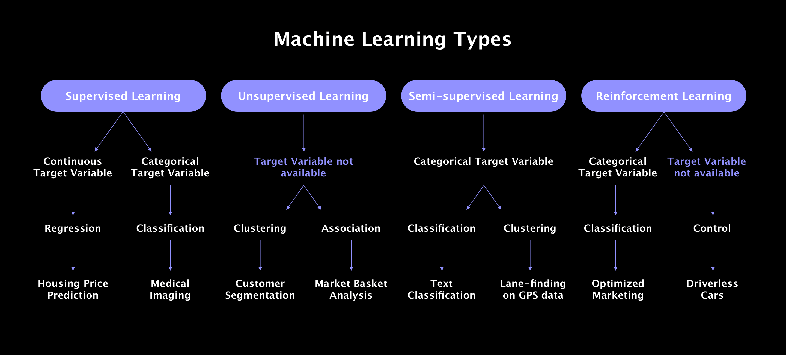

# Machine Learning Algorithms Repository

Welcome to the Machine Learning Algorithms Repository! This repository hosts a diverse collection of machine learning algorithms, carefully curated to cover a wide spectrum of techniques and methodologies in the field of artificial intelligence.

## Overview

Machine learning is a rapidly evolving field with applications spanning across various domains, including computer vision, natural language processing, healthcare, finance, and more. This repository aims to provide a comprehensive resource for both beginners and experienced practitioners to explore, learn, and experiment with different machine learning algorithms.

## Features

- **Supervised Learning**: Explore algorithms that learn from labeled data, such as linear regression, logistic regression, support vector machines (SVM), decision trees, random forests, and more.
- **Unsupervised Learning**: Dive into algorithms for discovering patterns and structures in unlabeled data, including clustering algorithms like k-means, hierarchical clustering, and dimensionality reduction techniques like principal component analysis (PCA) and t-distributed stochastic neighbor embedding (t-SNE).
- **Model Evaluation**: Learn how to evaluate and assess the performance of machine learning models using metrics such as accuracy, precision, recall, F1-score, ROC curve, and AUC-ROC.
- **Implementation Examples**: Access code implementations and usage examples for each algorithm, facilitating easy understanding and adoption.
- **Documentation**: Find comprehensive documentation, explanations, and references to supplementary resources for deeper exploration of each algorithm.





## Usage

1. **Exploration**: Browse through the repository to discover various machine learning algorithms.
2. **Learning**: Study the implementation details and usage examples provided for each algorithm.
3. **Experimentation**: Experiment with different algorithms on your datasets or use the provided sample datasets for practice.
4. **Contribution**: If you have improvements or additional algorithms to contribute, feel free to submit pull requests to enhance the repository.

## Getting Started

To get started, simply clone this repository to your local machine:

```bash
git clone https://github.com/NathanaelTamirat/ML--algorithms.git
